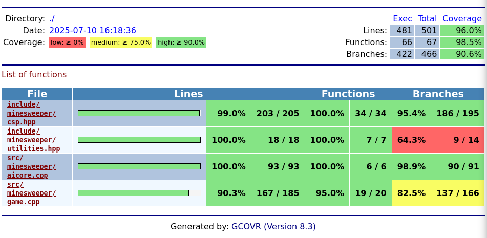

# Testausdokumentti

## Testikattavuus


Yksikkötestit on tehty kaikille toiminnallisille osille koodia, jotka vaikuttavat algoritmin toimintaan.
Terminaalikäyttöliittymää ei ole testattu yksikkötesteillä.

## Testaustavat

Algoritmia testataan ajamalla jokaista ratkaisuvaihetta muutamalla peliskenaariolla ja tarkistetaan vastaus.
Koko algoritmin toiminta testataan pelaamalla ratkaistavissa olevia pelejä ja vahvistetaan, että algoritmi ratkaisee pelin ilman arvauksia.
Testipelit on otettu [minesweeper.online](https://minesweeper.online) sivuston No guessing mode -peleistä.

Algoritmi laitetaan myös pelaamaan sata peliä, joissa tarkistetaan ettei yksikään algoritmin antamista siirroista ole virheellinen vaikka algoritmi pitää siirtoa varmana.

## Testien ajaminen

Kun projekti on rakennettu, testit voi ajaa komennolla ```ctest```.

Testikattavuusraportti vaatii ```gcovr``` ohjelman. Sen voi asentaa komennolla ```pip install gcovr```.
Raportin voi tämän jälkeen generoida komennolla ```make coverage``` ja sitä voi tarkastella avaamalla ```coverage.html```-tiedoston coverage-kansiosta.
